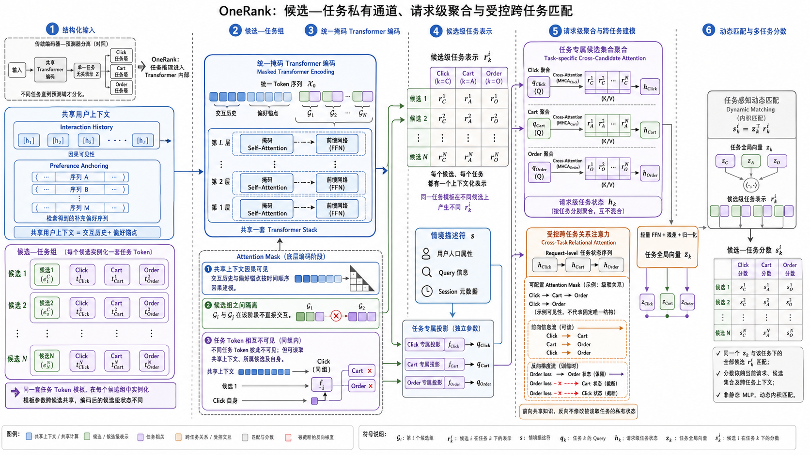
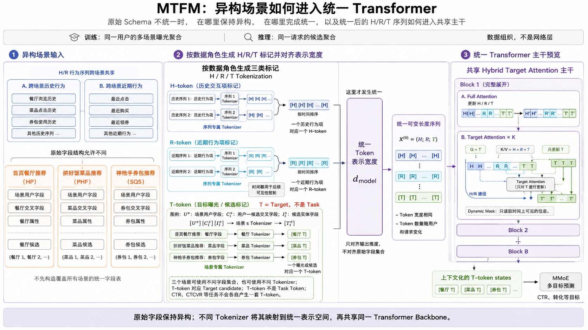

## 11. 前沿延伸：多分布推荐继续向哪里演进

MDL 把 Scenario 与 Task 从末端 gate / tower，提升为跨层保留、逐层读取 Feature states 的条件状态。但它假设了一个前提：**不同场景、不同任务共用同一套 raw feature schema**，只是读取方式该不该分化。2026 年的 OneRank 与 MTFM 分别在这个前提之外提出了新问题：

| 工作 | 追问的前提 |
|---|---|
| OneRank | 就算 Task 已经能分化读取，Transformer 编码完之后为什么还要切换到一套外挂的静态 MLP 预测器？ |
| MTFM | 如果不同场景连 schema 都不一样（有的字段别的场景根本没有），"共用一套输入" 这个前提还成立吗？ |

三者不是迭代关系，而是三种互补的问题意识：

> **MDL 管条件如何深入主干；OneRank 管 Transformer 编码完之后还要不要切出去做预测；MTFM 管 schema 都对不齐时怎么还共享一个主干。**

---

## 11.1 OneRank：把多任务推理放进 Transformer 内部

### 模型背景

多数工业 Transformer 排序模型仍是「共享编码器 + 多任务预测器」：$\mathcal{G}(\mathbf{Z}=\mathcal{F}(\mathbf{X}))$，Transformer 只是把 $\mathcal{F}$ 换成了更强的编码器，$\mathcal{G}$（MMoE/PLE/多塔）还是外挂的静态 MLP。OneRank 指出这个「encoder-predictor 分离」结构本身有三个问题：

| 问题 | 具体表现 |
|---|---|
| Task-agnostic 信息瓶颈 | $\mathbf{Z}$ 是所有任务共享的融合表示，任务差异只能留到预测端才去解耦 |
| Seesaw phenomenon | 多任务梯度共同作用于共享参数 $\mathcal{F}$，容易互相拖累 |
| Dataflow 断层 | Transformer 内部是 attention 式、随上下文变化的动态路由；$\mathcal{G}$ 却是固定的静态前馈决策边界，两种计算范式在编码结束后被迫切换 |

**和 MDL 背景的差异**：MDL 的问题是 Scenario/Task 信息只在末端生效，条件路径跟不上主干深度；OneRank 的问题更彻底——它认为只要还存在"编码器算完、交给外部预测器"这个动作，无论编码器多深，都会在预测那一刻发生一次 dataflow 断层。OneRank 要做的不是把 Task 状态挪进 Transformer 早期（MDL 已经做到这点），而是让 Transformer 从输入到打分全程不出戏。

### 模型收益

**离线（Shopee 数据集，3.3 亿曝光 / 33M 用户 / 30 天日志）**

| Encoder + Predictor | Params | FLOPs | C-AUC | A-AUC | O-AUC |
|---|---:|---:|---:|---:|---:|
| 最强基线：OneTrans + PLE | 6.4M | 823M | 0.7770 | 0.8371 | 0.8996 |
| **OneRank（Ours）** | 4.9M | 1.0G | **0.7910** | **0.8463** | **0.9024** |

参数更少但 FLOPs 略高（预测端算力从外部 MLP 挪回了 Transformer），三个任务的 AUC/GAUC 全面超过所有 encoder×predictor 组合。消融显示：去掉任务专属 token 使 A-AUC 从 0.8463 掉到 0.8424；去掉 situational descriptor（换成随机参数）伤害最大，C-AUC 掉到 0.7872；去掉梯度隔离会在 add-to-cart 任务上出现不稳定。

**线上（Shopee 主排序场景，2026-01-08 至 01-14，实验/对照各 10% 流量）**

| GMV/UU | Paid GMV/UU | 广告收入/UU | Bad Query Rate |
|---|---|---|---|
| +1.01% | +1.17% | +0.81% | −2.29% |

### 模型架构

OneRank 分四步，把「任务分化 → 候选竞争 → 任务关系 → 打分」全部留在 Transformer 内部：

| 步骤 | 做法 |
|---|---|
| ① 结构化输入 + 任务专属 token | 每个候选 $c_i$ 组成一个 token 组：候选 embedding + $K$ 个共享参数的任务 token（Click/ATC/Order）。注意力掩码让不同候选组互不可见，同组内不同任务 token 也互不可见（mutual invisibility），只能看用户上下文和自己所在候选 |
| ② 候选感知的请求级聚合 | 用一个 Situational Descriptor（用户画像/query/session）作为每个任务的 Query，对全体候选的任务表示 $\{r_k^i\}$ 做 task-specific 的 cross-attention，聚合出该任务在整个候选集合上的全局表示 $h_k$——弥补传统 point-wise 训练与请求级排序之间的 gap |
| ③ 受控的 Task–Task 交互 | 在 $K$ 个任务全局表示 $\{h_k\}$ 之间做可配置 mask 的 self-attention：Parallel（互不可见）/Null（全互见）/Cascade（Click→ATC→Order 单向）/Hybrid 均可配置。**前向**允许信息流动，**反向**用 gradient detachment 只保留对角线梯度，跨任务attention 变成 read-only 知识迁移 |
| ④ 动态匹配打分 | 抛弃静态 MLP 头，直接用融合后的任务全局向量与候选任务表示做内积 $s_k^i=\mathbf{z}_k^\top\mathbf{r}_k^i$，打分随会话上下文动态变化 |

**和 MDL 架构的差异**

| | MDL | OneRank |
|---|---|---|
| Task 状态挂在哪 | 样本级、与候选无关的独立 Task token，逐层读 Feature | 挂在**每个候选**上（K 个 task token 随候选复制），天然自带候选身份 |
| Task 之间是否交互 | 无独立 mixing；关系只经共享 Feature 间接形成 | 显式 Task–Task cross-attention，mask 可配置（parallel/cascade/hybrid） |
| 梯度处理 | 各任务损失仍经 attention 的 K/V 更新共享 Feature，无跨任务梯度隔离 | Cross-task attention 做 gradient detachment：前向共享、反向对角 |
| 候选竞争建模 | 无；本质 point-wise，不显式建模同请求候选间的竞争 | 有；situational descriptor 把整批候选聚合进任务表示，专门弥补训练-serving gap |
| 打分方式 | 每个 Task token 连接固定 logits head | 任务全局向量与候选表示做内积，动态匹配 |
| Scenario 轴 | 有独立 Scenario/Global token 与实例级选择 | 未涉及，论文聚焦多任务而非多场景 |

> **MDL 让 Scenario 与 Task 逐层读取共享 Feature capacity；OneRank 在此基础上继续追问：任务已经拿到专属通道之后，候选之间的竞争、任务之间的知识流动、梯度边界、打分方式，能不能也留在 Transformer 内部一次性解决？**

---

## 11.2 MTFM：当不同场景的输入空间也无法对齐

### 模型背景

美团把「推荐 Foundation Model」需要具备的三个属性定义为 Scalability（模型和数据越大效果越稳定变好）、Extensibility（能低成本接入新场景）、Efficiency（多场景数据量暴增时算力可控）。而现有多场景方法几乎都遵循 "harmonize-then-decompose"：先把各场景数据整理成统一模板，再把参数拆成 domain-invariant / domain-specific（典型如 STAR、M3oE、MLoRA）。MTFM 指出这个范式在三点上撑不住：

| 局限 | 具体表现 |
|---|---|
| Extensibility 差 | 餐厅推荐和菜品推荐的 feature schema 天生不同（不同供给类型、不同 UI），字段强行对齐必然丢信息或者靠 padding 硬凑 |
| 结构不可扩展 | 现有结构大多是专家手工设计好应对固定几个场景，换个场景就要重新设计，无法享受 scaling law |
| 算力不可持续 | 多场景数据暴力拼接后训练成本随数据量线性增长，工业上不可持续 |

**和 MDL 背景的差异**：MDL 默认所有场景共用同一套 raw feature（Feature token 分组对所有场景一致），只是场景/任务该怎么读取这份共享表示存在争议；MTFM 面对的问题更前置——不同场景的原始字段本身就对不上，`schema` 这一层的统一根本无法达成，需要先解决"怎么进模型"，再谈"怎么共享"。

### 模型收益

**离线（美团 HP 餐厅推荐 / PHF 菜品推荐 / SQS 券包推荐，三场景合计曝光 36 亿+）**

| 任务 | 平均 GAUC 提升 | 最大 GAUC 提升 |
|---|---:|---:|
| CTR | +0.36pp | +0.76pp |
| CTCVR | +0.29pp | +0.53pp |

MTFM 在 HP/PHF/SQS 三个场景上全面超过 RankMixer、MTGR、OneTrans（生成式排序）与 STAR、PEPNet（多场景方法）；论文特别指出 STAR/PEPNet 存在明显 see-saw（PEPNet 在 HP/PHF 领先但 SQS 落后），而 MTFM 没有这个问题。

**效率**：Hybrid Target Attention 相比纯 Full Attention 提速 2×（780 vs 390 samples/s），显存从 66.97GB 降到 67.49GB 左右打平但吞吐翻倍；训练侧 CPU-GPU pipeline 优化 +20% 吞吐，自定义 kernel（FlashAttention-2 + Triton 融合算子）再 +57%；推理侧 2:4 结构化稀疏 +10% 吞吐、−0.2ms 延迟。

**可扩展性**：模型规模从 10× 扩到 70× 时，三个场景的 CTCVR GAUC 都呈现稳定的 scaling law 斜率；同一模型规模下训练数据量越大效果越好，且大模型和小模型的差距随数据量增加而拉大。

**线上（两场景 A/B）**

| 场景 | CTR | UV_CTCVR | 订单量 | 延迟 |
|---|---:|---:|---:|---:|
| SQS 券包推荐 | +1.89% | +2.46% | +2.98% | −5ms |
| PHF 菜品推荐 | +1.53% | +1.03% | +1.45% | −6ms |

### 模型架构

MTFM 把「怎么让异构场景进同一个模型」拆成两层：先用 token 统一表示层，再用稀疏 attention 控制算力。

| 环节 | 做法 |
|---|---|
| Heterogeneous tokenization | 三类 token：H-token（历史行为，跨场景共享）、R-token（实时行为，跨场景共享）、T-token（当前场景曝光候选，场景专属，由 $\mathrm{MLP}_s(\mathrm{Emb}(U^s) \| \mathrm{Emb}(C_i^s) \| \mathrm{Emb}(I_i^s))$ 生成）。各类各场景用各自的 tokenizer，只需投影到统一的 $d_{model}$，拼成一条变长序列 $\mathbf{X}^{(0)}=(\mathbf{H};\mathbf{R};\mathbf{T})$ |
| Hybrid Target Attention | 每个 Block 内 1 层 Full Attention + $K$ 层 Target Attention 交替：Full Attention 层对 H/R/T 全部 token 做 GQA self-attention（按序列/场景分组做 Group LayerNorm）；Target Attention 层只更新 T-token，用全部 token 作为 K/V，H/R token 靠 shortcut 直接传到下一层。复杂度从 $O(N^2)$ 降到 $O(\frac{KNL_T+N^2}{K+1})$，$L_T \ll N$ |
| Dynamic mask | H-token 对所有 token 可见；R-token 只对时间戳更晚的 token 可见（防泄漏）；**T-token 只能看到自己，看不到其他 T-token**——包括同场景的其他候选，也包括其他场景的候选 |
| 系统协同设计 | 训练侧按用户聚合多场景曝光减少样本冗余；推理侧按场景切出独立子图，只算该场景相关的 T-token 与共享 H/R，跳过其他场景的专属参数 |
| 任务预测端 | 最终层 T-token 表示送入传统 MMoE，输出该场景下 CTR/CTCVR 等多目标预测 |

**和 MDL 架构的差异**

| | MDL | MTFM |
|---|---|---|
| Token 组织依据 | 按语义职责分三类：Feature（共享证据）/ Scenario / Task（条件） | 按数据来源与时间角色分三类：H（历史）/ R（实时）/ T（当前场景候选） |
| 谁代表"场景" | 独立于 Feature 之外的 Scenario token，逐层从 Feature 读取信息再融合进 Task | 场景信息直接嵌进 T-token 本身（scenario-specific tokenizer + 专属参数），没有独立于候选之外的 Scenario 状态 |
| 主干自更新范围 | Feature self-interaction 只更新 Feature，Domain（Scenario/Task）不参与主干自更新 | Full Attention 层里 H/R/T **全部**一起做 self-attention 更新，Target Attention 层才收窄到只更新 T |
| 跨场景/跨任务 token 是否互见 | Scenario 之间、Task 之间都无独立 mixing，只能借共享 Feature 间接联系 | T-token 之间（包括同场景内的候选）**在任何一层都不能互相看到**，跨场景知识只能借共享的 H/R token 间接传递——和 MDL "禁止 Domain-Domain 直接 mixing"的设计思路高度一致，但落在完全不同的 token 类型上 |
| 任务预测端 | Task token 各自连接固定 logits head，Task 状态本身就是条件化产物 | 场景专属的候选表示算完后，仍交给外部 MMoE 做多任务预测——任务这一维没有被重新设计，重点全在场景/输入这一维 |
| 效率手段 | 无稀疏 attention 设计，依赖 RankMixer 式 per-token FFN 控制主干成本 | Hybrid Target Attention + GQA 专门解决异构长序列的二次复杂度问题 |

> **MDL 解决的是"字段能对齐时，场景与任务该怎样读取共享主干"；MTFM 解决的是"字段对不齐时，怎样先把异构数据变成能进同一个主干的 token，再把算力控制住"。**

---

## 11.3 从扩大共享主干，到重新设计信息与梯度边界

三篇工作分别卡住了工业 Transformer 排序不同的关节：

| 工作 | 核心问题 | 解法落点 |
|---|---|---|
| MDL | 条件信息能读取哪些模型容量 | Scenario/Task 逐层读 Feature，不重复计算主干 |
| OneRank | Encoder 算完之后还要不要切到外部预测器；任务之间信息与梯度能不能分开处理 | 任务 token 挂在候选上、候选级聚合、Task–Task 受控 attention + 梯度隔离、动态匹配打分，全程留在 Transformer 内 |
| MTFM | 什么样的异构数据能进同一个模型；进去之后算力能不能扩展 | H/R/T 异构 tokenization + Hybrid Target Attention + 系统级协同优化 |

三者共同指向的趋势，不是继续把主干做深做宽，而是同时重新设计三件事：

1. 不同信息以什么 token / 状态进入模型（MDL 的三类职责 token、OneRank 的候选-任务 token 组、MTFM 的 H/R/T）；
2. 哪些状态能读取或影响其他状态（MDL 的有向读取、OneRank 的候选聚合与受控 Task–Task、MTFM 的 Full/Target Attention 切换与 T-token 互斥可见性）；
3. 哪些梯度可以在任务与场景之间传播（MDL 未显式处理、OneRank 的 gradient detachment、MTFM 靠子图解耦规避而非梯度层面处理）。

> **大模型化的工业推荐，不只是扩大共享容量，而是让信息流、任务关系和计算边界都能够随模型规模一起扩展。**
